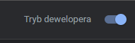
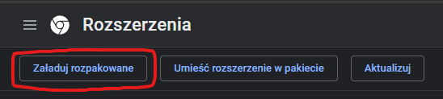

# Chess.com-Center-Board
Removes the ad on the right side of the screen whenever it is present in order to center the chessboard along with the sidebar.

## How to install
1. After downloading the folder in a desired location open the following page in chrome:
`chrome://extensions/`

2. Make sure to enable **developer mode** (top right corner).

3. Click the **Load unpacked** button and select the extension directory.

After pinning it you can either enable or disable it anytime (make sure to refresh the page for the changes to take effect).